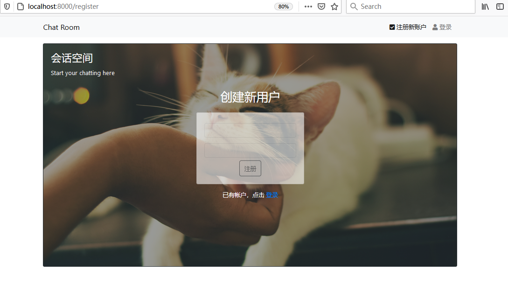
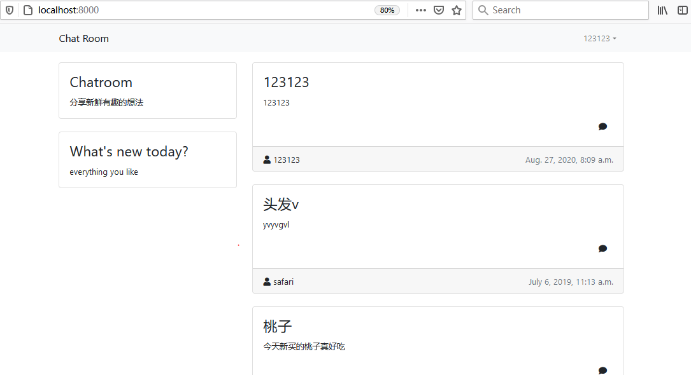
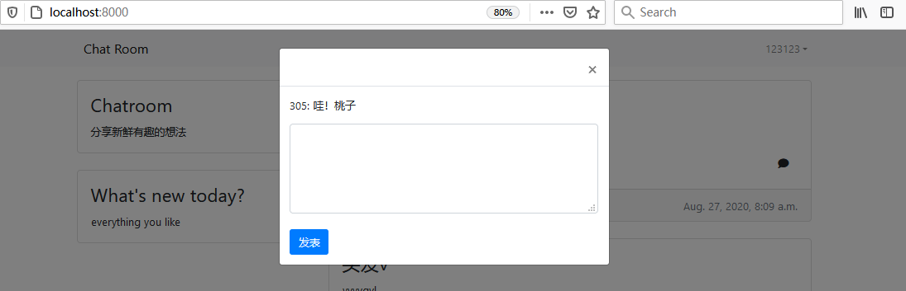
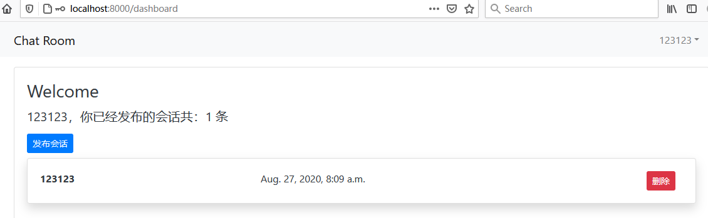
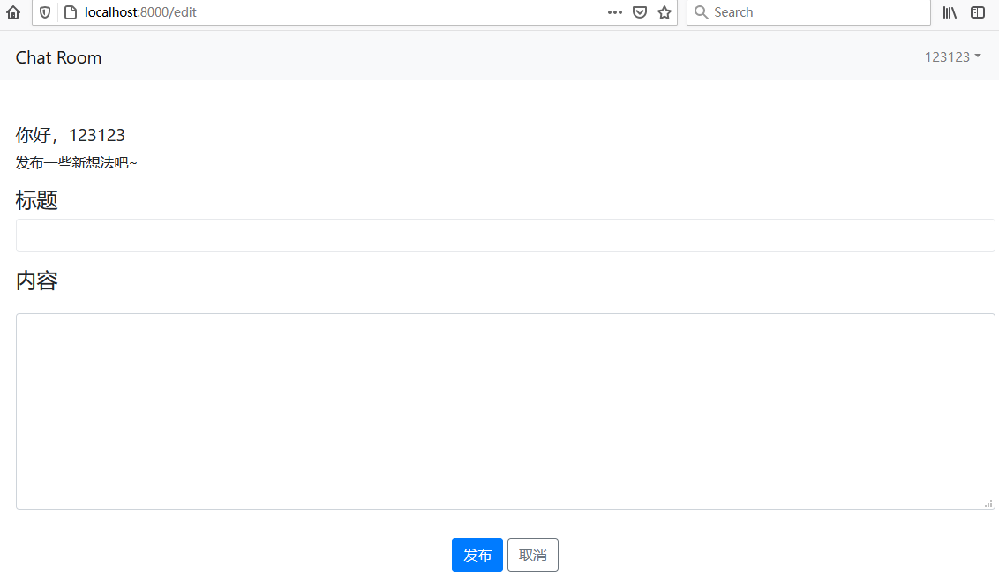

### 主要功能

​	注册/登录，个人面板消息管理，发布动态，查看/发表评论。

### 数据结构

```python
class Post(models.Model):
    post_title = models.CharField(max_length=30)
    post_content = models.TextField()
    post_created_by = models.CharField(max_length=30)
    post_created_at = models.DateTimeField(auto_now_add=True)

class Comment(models.Model):
    comment_by = models.CharField(max_length=30)
    comment_at = models.DateTimeField(auto_now_add=True)
    comment_content = models.TextField()
    comment_on = models.CharField(max_length=30)
```

### 路由

```python
urlpatterns = [
    path('',views.chat_page),
    path('login',views.login_page),
    path('register',views.register_page),
    path('edit',views.edit_page),
    path('dashboard',views.dashboard_page),
    path('create_post',views.create_post),
    path('post/<int:id>/delete',views.delete_post),
    path('post_comment',views.post_comment),
    path('logout',views.log_out)
]
```

### 测试

设置将项目跑在8000端口，使用浏览器打开：localhost:8000。

```python
python manage.py runserver 0.0.0.0:8000
```

注册/登录页面：



主页（已登录状态，右上角有用户名）：



评论查看/发布弹框：



个人面板页面：



编辑动态页面：



